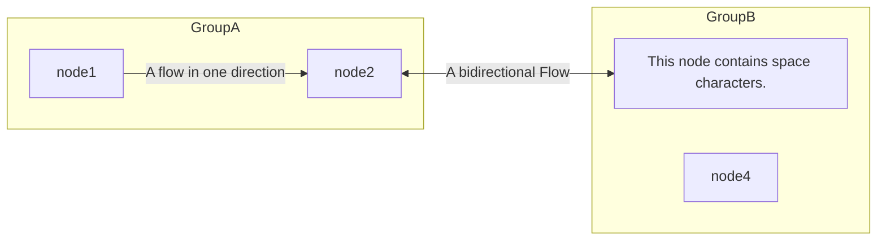

# Our Program
## Flow Chart
An overview of our program's logic.

```mermaid
flowchart LR
%%%%%%%%%%%%%%%%%%%%%%%%%%
%% Node Description
%%%%%%%%%%%%%%%%%%%%%%%%%%
subgraph GroupA 
    node1
	node2
end

subgraph GroupB
    node3[This node contains space characters.]
	node4
end
%%%%%%%%%%%%%%%%%%%%%%%%%%
%% Node Dependencies
%%%%%%%%%%%%%%%%%%%%%%%%%%

node1 -->|A flow in one direction| node2
node2 <-->|A bidirectional Flow| node3
```

# Mermaid Docs
How to create Flowcharts:
https://mermaid.js.org/syntax/flowchart.html?id=flowcharts-basic-syntax

